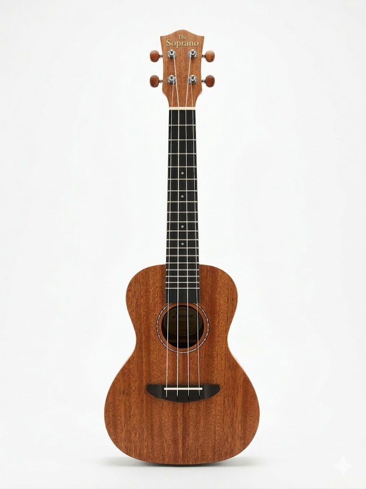

# The Soprano: The missing piece in the guitar family

> Bass digitation. Ukulele size. Guitar tone.

## The Origin

As a guitarist, I’ve always been grateful for the existence of the bass guitar. It uses the exact same notes and the exact same digitation, but sits one octave lower in a much larger body. It exists to supplement the soundscape with deep frequencies and thickness.

Because of that perfect symmetry, I always felt there was a missing piece on the exact opposite side of the spectrum: a soprano guitar. I wanted an instrument that mirrored the logic, but sat one octave *above* the standard guitar. 

To be fair, some approximations to this concept exist. You can find piccolo guitars or specialized travel instruments, but they are expensive, niche, and largely unavailable. I didn't want a boutique collector's item; I needed a highly portable, low-cost tool with a familiar and rich sound that I could throw in a backpack.

So, I built it myself.

---

## The Concept

**The Soprano** is a custom 4-string acoustic instrument built from a standard concert ukulele and classical guitar strings. 

It is tuned **E3 · A3 · D4 · G4** (all perfect fourths). 

If you play bass or the bottom strings of a guitar, you already know the entire fretboard. Your scales, arpeggios, and digitation translate instantly. No mental transposition required.

---

## The Secret: Why it sounds like a Guitar

The magic of **The Soprano** isn't just the tuning; it's a fundamental hardware refactoring. 

A standard ukulele is designed for high-frequency sweetness. It usually features "reentrant" tuning (where the 4th string is tuned higher than the 3rd), creating that characteristic, airy "plink" that lacks any structural weight.

**The Soprano** destroys this limitation by utilizing **wound metal classical guitar strings** for the low E and A. Putting thick, wound strings on a short 15-inch scale creates high tension and real mass.

The result is a warm, percussive attack with actual sustain. It gives you the physical resistance and tactile response of a real guitar in a body you can take on a hike.

---

## How to build your own

You don't need to be a luthier. You need $20 and 10 minutes.

**What you need:**
- A **concert ukulele** (Any brand, any price. The cheaper, the less you'll worry about taking it everywhere).
- One set of **normal tension classical guitar strings**.

**The Build:**
1. **Strings 1 & 2 (High G4, D4):** You can keep the original high strings of the ukulele (tuned down slightly), or use the 1st and 2nd nylon strings from the classical guitar set for better tension.
2. **Strings 3 & 4 (Low A3, E3):** This is the core. Use the **4th (D) and 5th (A) wound strings** from the classical guitar set. 
3. **The Mod:** The new wound strings will likely be too thick for the standard slots in the nut and bridge. Use a small file (or folded sandpaper) to widen the slots just enough so the strings sit flush. 
4. String it up, stretch the strings, and tune to E-A-D-G.

---

## Who is this for?

- **The traveling bassist** who wants a practice instrument they can pick up anywhere without learning new chord shapes.
- **The commuting guitarist** looking for a highly portable, 4-string writing tool.
- **The late-night player** who needs a quiet but rich-sounding instrument to compose on without waking up the house.
- Anyone who has a dusty ukulele in the closet and wants to turn it into a serious musical tool.
